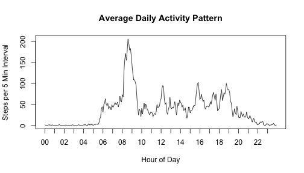

# Reproducible Research: Peer Assessment 1
==========================================

## Loading and preprocessing the data

```r
   activity.frm <- read.table('activity.csv', header=T, sep=',', as.is=T)
   head(activity.frm)
```

```
##   steps       date interval
## 1    NA 2012-10-01        0
## 2    NA 2012-10-01        5
## 3    NA 2012-10-01       10
## 4    NA 2012-10-01       15
## 5    NA 2012-10-01       20
## 6    NA 2012-10-01       25
```

```r
   Hr.vec  <- activity.frm$interval %/% 100
   Hr.vec = formatC(Hr.vec, width=2, flag='0')
   Min.vec <- activity.frm$interval %% 100
   Min.vec = formatC(Min.vec, width=2, flag='0')
   DayofWeek.vec <- weekdays(as.Date(activity.frm$date))
   DayType.vec <- ifelse(is.element(DayofWeek.vec, c('Saturday', 'Sunday')), 'WeekEnd', 'WeekDay')

   Act.frm <- data.frame(
      Date = activity.frm$date,
      DayofWeek = DayofWeek.vec,
      DayType = DayType.vec,
      Hr = Hr.vec, 
      Min = Min.vec, 
      HrMin = paste(Hr.vec, Min.vec, sep=':'),
      Interval = activity.frm$interval,
      Steps = activity.frm$steps )
```

## What is mean total number of steps taken per day?

```r
   with(Act.frm,
      Steps.ByDay.lst <<- split(Steps, Date)
      )
   Steps.PerDay.vec <- sapply(Steps.ByDay.lst, sum, narm=T)

   hist(Steps.PerDay.vec, xlab='Steps per Day', main='Total Number of Steps per Day')
```

 

```r
   cat('Mean =', mean(Steps.PerDay.vec, na.rm=T), '\n')
```

```
## Mean = 10767.19
```

```r
   cat('Median =', median(Steps.PerDay.vec, na.rm=T), '\n')
```

```
## Median = 10766
```


## What is the average daily activity pattern?

```r
   StepsByInt.frm <- aggregate(Steps ~ HrMin, data=Act.frm, FUN=mean, na.rm=T)
   
   plot(StepsByInt.frm$Steps, xlab='Hour of Day', ylab='Steps per 5 Min Interval', type='l', xaxt='n')
   Hour.vec <- sapply(strsplit(as.character(StepsByInt.frm$HrMin), split=':'), function(x) x[1])
   axis(side=1, at=match(unique(Hour.vec), Hour.vec), Hour.vec[match(unique(Hour.vec), Hour.vec)],
     las=1)
   title("Average Daily Activity Pattern")
```

 

```r
   cat("On average, the maximum number of steps occurs at:", 
       as.character(StepsByInt.frm$HrMin[which.max(StepsByInt.frm$Steps)]), '\n')
```

```
## On average, the maximum number of steps occurs at: 08:35
```

## Imputing missing values

```r
   cat("Number of missing values:", sum(is.na(Act.frm$Steps)),'\n')
```

```
## Number of missing values: 2304
```

```r
   ### Impute missing Steps with median of day and inteval matched values
   
   Day_HrMin.vec <- paste(Act.frm$DayofWeek, Act.frm$HrMin, sep='_')
   Day_HrMin.Step.lst <- split(Act.frm$Steps, Day_HrMin.vec)
   Day_HrMin.medianStep.vec <- sapply(Day_HrMin.Step.lst, median, na.rm=T)[Day_HrMin.vec]
   Act.frm$Steps <- ifelse(is.na(Act.frm$Steps), Day_HrMin.medianStep.vec, Act.frm$Steps)

   with(Act.frm,
      Steps.ByDay.lst <<- split(Steps, Date)
      )
   Steps.PerDay.vec <- sapply(Steps.ByDay.lst, sum, narm=T)
   hist(Steps.PerDay.vec, xlab='Steps per Day', main='Total Number of Steps per Day (Imputed)')
```

 

```r
   cat('Mean =', mean(Steps.PerDay.vec, na.rm=T), '\n')
```

```
## Mean = 9706.238
```

```r
   cat('Median =', median(Steps.PerDay.vec, na.rm=T), '\n')
```

```
## Median = 10396
```

## Are there differences in activity patterns between weekdays and weekends?

```r
   library(lattice)

   StepsByIntDayType.frm <- aggregate(Steps ~ HrMin * DayType, data=Act.frm, FUN=mean, na.rm=T)
   StepsByIntDayType.frm$HrMin <- as.factor(StepsByIntDayType.frm$HrMin)
   StepsByIntDayType.frm$DayType <- as.factor(StepsByIntDayType.frm$DayType)
   at.vec <- pretty(1:length(unique(StepsByIntDayType.frm$HrMin)))[-1]

   plot(xyplot(Steps ~ HrMin | DayType, data=StepsByIntDayType.frm, type='l', layout=c(1,2),
        scales=list(x=list(at=at.vec, labels=unique(StepsByIntDayType.frm$HrMin)[at.vec])),
        main="Average Daily Activity Pattern by Day Type"))
```

 

